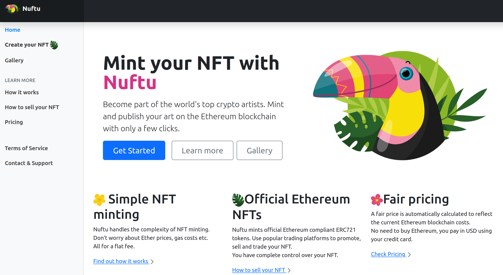
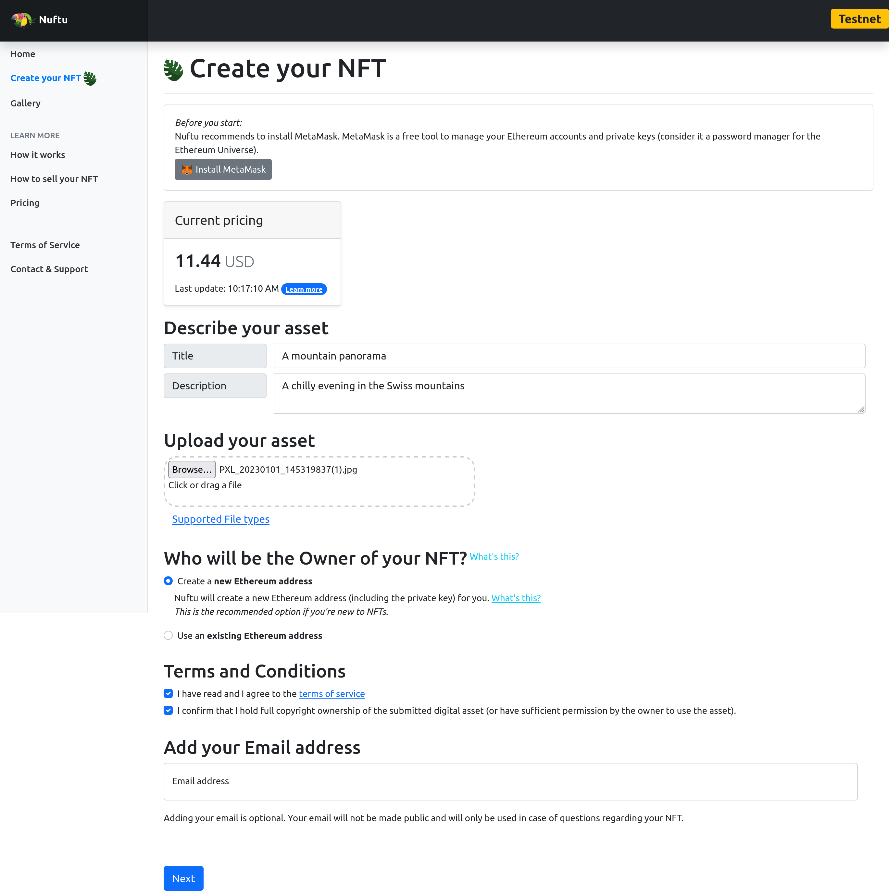
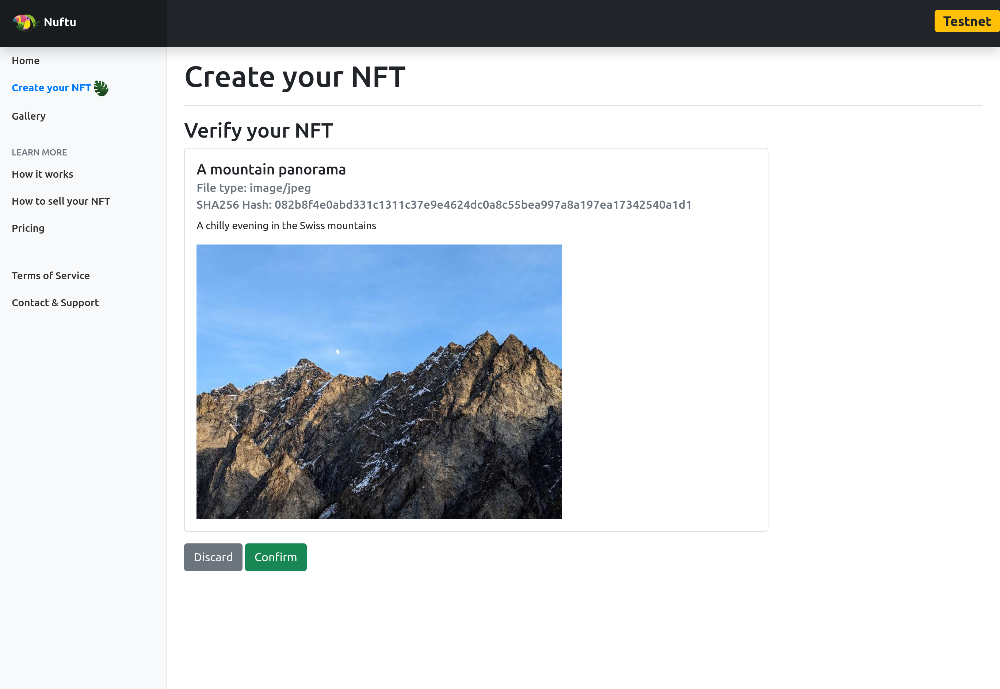
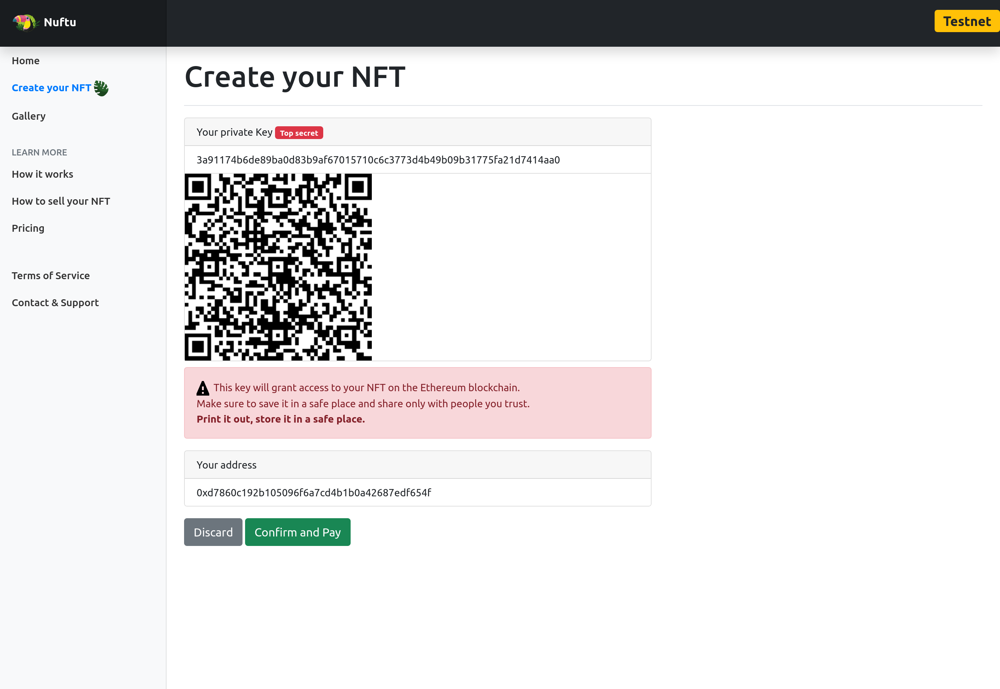

# Nuftu

Nuftu.com ~~is~~ was a webservice enabling non-technically versed
artists to mint official Ethereum compliant ERC721 tokens (NFTs).

Users would pay a flat fee in fiat currency (handled by [Payrexx](https://www.payrexx.com/)),
upload their artwork (image file, PDF, movie) and a description
and Nuftu would handle the interaction with Ethereum blockchain
over [Infura](https://www.infura.io/), minting
a [Nuftu token](https://etherscan.io/token/0x61a17d56fc6548bfd114be130ae2cc74d69ecd33),
while taking care of gas fees etc.

The tag line is basically: "**Nuftu is simple: upload your digital artwork and pay the fee in USD - your NFT is ready!
**"



Nuftu was decomissioned in late 2022 due to lack of interest and
open sourced under MIT license in early 2023.

## User flow

### Step 1

Current pricing is dynamically calculated based on the current gas prices.

The user uploads his artwork (supported file types for images, drawings, animations,
video, and audio), selects if Nuftu should create a new Ethereum address or if the user
wants to link an existing wallet via [MetaMask](https://metamask.io/).



### Step 2

Confirmation: let the user verify the entered information.


### Step 3

If the user selected to create a new Ethereum address in Step 1,
here's the address and the private key to safely store and print out.
This is the only and last chance to view the private key, it will not
be stored anywhere. The address on the other hand is publically visible
and will be used for the ownership of the newly minted NFT.


### Step 4

Forward to Payrexx for payment via credit card.

### Step 5

This is invisible to the user. After Payrexx has confirmed the payment,
Nuftu will start the minting process via Infura.
The gas fees will be paid from the balance
of [Nuftu's ethereum address](https://etherscan.io/address/0x1cddd9ab75a9079ed64078fd9bde544b9a12d222).

Minting is done via
the [Nuftu contract deployed on Ethereum](https://etherscan.io/address/0x61a17d56fc6548bfd114be130ae2cc74d69ecd33).

The Nuftu contract references the API on Nuftu.com (e.g. https://nuftu.com/api/0), which
points to artwork, title and description stored on a PostgreSQL instance on Nuftu.com.

As the Token is ERC721 compatible, it can also be viewed e.g.
on [OpenSea](https://opensea.io/assets/ethereum/0x61a17d56fc6548bfd114be130ae2cc74d69ecd33/0),
[Rarible](https://rarible.com/token/0x61a17d56fc6548bfd114be130ae2cc74d69ecd33:0).

## Key elements of Nuftu

### Ethereum Contract

[Nuftu.sol](/Assets/Solidity/Nuftu.sol) is the Ethereum contract
written in Solidity and deployed on following Ethereum address:
[`0x61a17d56fc6548bfd114be130ae2cc74d69ecd33`](https://etherscan.io/address/0x61a17d56fc6548bfd114be130ae2cc74d69ecd33)

### Backend

The backend is written in Java using Spring Boot.
[MainController.java](/src/main/java/com/genewarrior/nuftu/controllers/MainController.java) handles the Endpoints.

Important are:

- `/api/{token}`returns the JSON referenced by the minted token containing title, description and the link to the
  artwork.
  Example output:

```
{"name":"Nuftu NFT #0",
"description":"The first NFT minted on Nuftu.",
"externalUrl":"https://nuftu.com/nft/0",
"image":"https://nuftu.com/api/file/0"}
```

- `/api/file/{token}` returns the file (image, audio, video, PDF etc.) that is referenced in the `/api/{token}` call.
- `/nft/{token}` returns a 'nice' view (HTML) of the minted token for viewing. It uses the
  `tokenview.html` template (Thymeleaf).

### Interaction with Ethereum Blockchain

Nuftu uses [Infura](https://www.infura.io/) as mediator, and the
[Web3j](https://docs.web3j.io/) library.

Minting is handled in [MintingService.java](/src/main/java/com/genewarrior/nuftu/controllers/MintingService.java)

### Sign up process

Sign up process is handled in
the [CreateController.java](/src/main/java/com/genewarrior/nuftu/controllers/CreateController.java),
relying on the [UserSessionData.java](/src/main/java/com/genewarrior/nuftu/controllers/UserSessionData.java).

Front end views are also handled via Thymeleaf templates.

### Database

A PostgreSQL database stores the metadata (title, description, file as byte array) in a table called
`M̀etadata`, see [Metadata.java](/src/main/java/com/genewarrior/nuftu/database/Metadata.java) for the Spring Boot JPA
Entity.

Jackson is used for JSON output for the `/api/` endpoints.

### Payment flow

Payment is handled via [Payrexx](https://www.payrexx.com/), a third party payment provider.
The flow is handled in [PaymentTools.java](/src/main/java/com/genewarrior/nuftu/payment/PaymentTools.java)
and [PayrexxGateway.java](/src/main/java/com/genewarrior/nuftu/payment/PayrexxGateway.java).

# Gallery

The gallery (`/find`) shows the thumbnails of all minted tokens. Below is a screenshot taken in late 2022.

